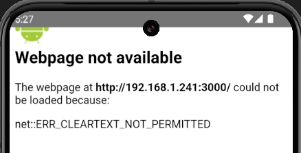

## Created with Capacitor Create App

A minimal reproduction for Android live reload config issues in Capacitor 5.7.2. See https://github.com/ionic-team/capacitor/issues/7323 for the bug details.

This app was created using [`@capacitor/create-app`](https://github.com/ionic-team/create-capacitor-app).

### Installing

- You will need Node.JS
- Ensure Android Studio is installed, and that `ANDROID_HOME` is set (e.g. `export ANDROID_HOME=$ANDROID_SDK_ROOT`)
- `npm install` in the root dir

### Running this example

1. Start the live reload server, which will run on host machine port 3000

```bash
npm run start:server
```

2. In a new terminal, run the Android capacitor app, which is set up for live reload pointing to that server:

```bash
npm run start:android
```

If you want to see what these commands do, peek at [package.json](https://github.com/alextreppass/capacitor-live-reload-bug/blob/4c3e4cc6cb2d598d6804392263537211eb70e8ab/package.json#L6-L7)

### Issues

You will see an `ERR_CLEARTEXT_NOT_PERMITTED` error:



- Observe that the generated `android/capacitor-cordova-android-plugins/src/main/AndroidManifest.xml`'s `<application>` tag is not patched to contain `android:usesCleartextTraffic="true"`

- Capacitor's [cordova.ts](https://github.com/ionic-team/capacitor/blob/2d87deed6ccb36a39438a9ff4b82f1d833823cb9/cli/src/cordova.ts#L1080-L1107) should be adding this when run in live reload mode. It does not seem to be doing so in v5.7.2

### Workaround

If we manually add the clear text attribute back in, it will work:

1. Add `android:usesCleartextTraffic="true"` to the `<application>` tag in the _main_ [AndroidManifest.xml](./android/app/src/main/AndroidManifest.xml) (not the generated one)
2. Run the android simulator, and observe you now see the contents of `src/index.html`
3. Edit `src/index.html` and see the app live reloading successfully

This is not a good workaround, however, as [it is insecure](https://developer.android.com/guide/topics/manifest/application-element#usesCleartextTraffic).

We also cannot reliably time + manually patch the cordova android plugin `AndroidManifest.xml` as we do not control when that's generated.
